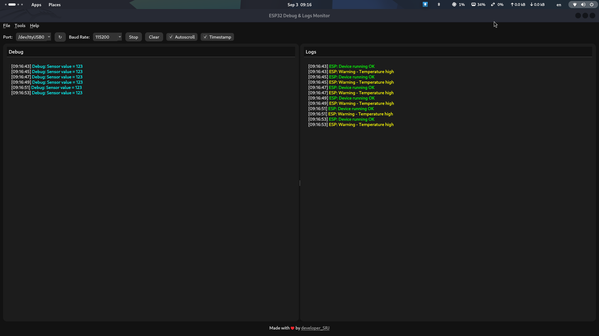

# ESP32-Serial v2

A **modern desktop serial monitor** for ESP32, built with **Python + PyQt6**, inspired by the original [ESP32-Serial (Web Edition)](https://github.com/developer-srj/ESP32-serial).
This version provides a **faster, more responsive** UI without websockets, while keeping the same clean dark theme design.

Shout out to **[@parthbhat13](https://github.com/parthbhat13)** for the idea & guidance!

---

## Table of Contents

* [Features](#features)
* [Installation Guide](#installation-guide)
* [Requirements](#requirements)
* [Running the Project](#running-the-project)
* [Usage](#usage)
* [Global Installation](#global-installation)
* [Contributing](#contributing)
* [License](#license)

---


## Screenshots

### Main Interface



---
## Features

✅ Cross-platform (Linux, Mac, Windows\*)
✅ Clean dark-themed UI (PyQt6)
✅ Dual terminal view (Debug + Logs)
✅ Autoscroll & Timestamp support
✅ Save logs (separate Debug + ESP files)
✅ Clear terminal buttons
✅ Refresh ports list

\* Tested mainly on Linux. Windows/Mac may need tweaks.

---

## Installation Guide

### 1. Clone the Repository

```bash
git clone https://github.com/developer-srj/ESP32-serial-v2.git
```

### 2. Navigate to the Project Directory

```bash
cd ESP32-serial-v2
```

### 3. Make the run.sh File Executable

```bash
chmod +x run.sh
```

### 4. Run the Script

```bash
./run.sh
```

The first run will:

* Create a Python virtual environment (`venv/`)
* Install all dependencies from `requirements.txt`
* Start the serial monitor GUI

---

## Requirements

`requirements.txt` contains:

```
pyserial
PyQt6
```

These will be installed automatically when you run `./run.sh`.

---

## Running the Project

Run:

```bash
./run.sh
```

The app will open the **ESP32 Debug & Logs Monitor** window.

---

## Usage

* Select **Port** & **Baudrate**.
* Click **Start** to begin monitoring.
* Toggle **Autoscroll** and **Timestamp**.
* Use **Clear Logs** buttons to wipe terminal.
* Use **Save Logs** from the menu to store outputs in the `logs/` directory.
* Use **Refresh Ports** to re-detect connected ESP32 devices.

---

## Global Installation

If you want to run the monitor from anywhere (like a command):

### 1. Add it to your PATH

Edit your `~/.bashrc` (or `~/.zshrc`) and add:

```bash
export PATH="$HOME/ESP32-serial-v2:$PATH"
```

### 2. Make run.sh callable as `esp32-serial`

```bash
sudo ln -s $HOME/ESP32-serial-v2/run.sh /usr/local/bin/esp32-serial
```

### 3. Run from anywhere

```bash
esp32-serial
```

---

## Contributing

Want to improve it?

1. Fork this repo.
2. Create a branch (`git checkout -b feature-xyz`).
3. Commit your changes.
4. Push and open a PR.

---

## License

This project is licensed under the **MIT License** — see the [LICENSE](LICENSE) file for details.

---

### ✨ Credits

Made by [developer\_SRJ](https://github.com/developer-srj)

Shout out to **[@parthbhat13](https://github.com/parthbhat13)** for the idea & guidance!
